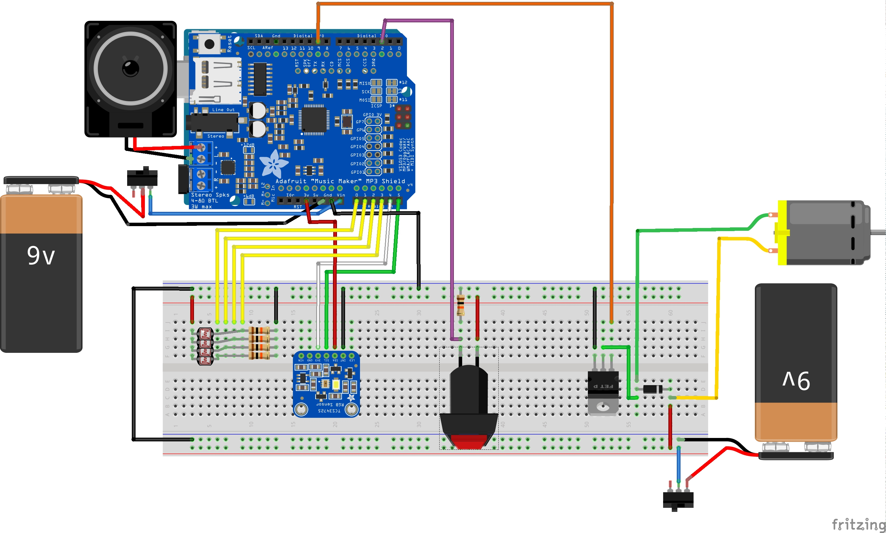
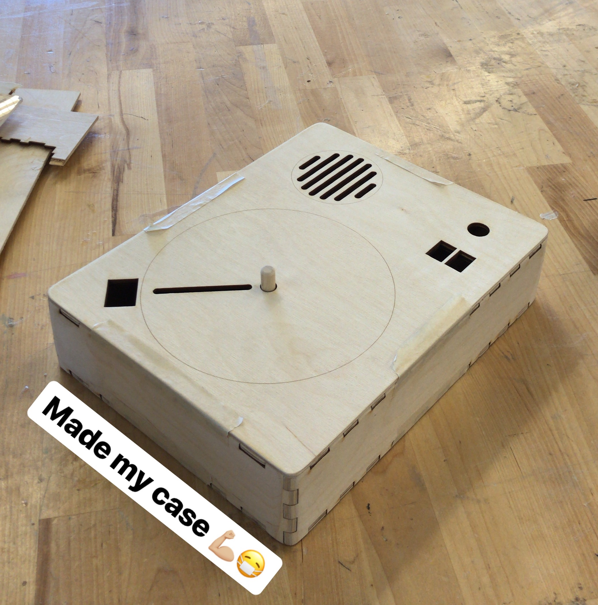

# Project Write-Up

## CD (for Color Disc)

### Project Goals

To make a "music player" that turns colorful patterns made by visitors into music. 

More specifically, the visitors can put colorful paper scraps on a disc, make it spin (and stop spinning,) and the system will translate the disc into music.

### Technical decisions

To achieve the goal, I use transparent cast acrylic and paper scraps in bright colors as the "disc". I also put an array of four LDRs (light dependent resistors) underneath and RGB sensor above the disc to "read" it. As the visitor pushes a button, a DC motor starts to rotate, driving the plate to spin. Meanwhile, the LDRs and RBG sensor send brightness and RGB data of a certain radius of the disc to an Arduino UNO. The Arduino program then maps the real-time data (weighted brightness level and color of one point) to different music files, which will finally be played by an Adafruit Music Maker Board.

### Schematic

(breadboard version)

### Parts list

Sensors

- RGB Color Sensor (TCS34725)
- Mini Photocells (LDRs)

Microprocessors

- Arduino UNO
- Adafruit Music Maker Shield

Other major components

- DC Motor
- Speaker

### Photos

#### Overall

the operational project (04/26)

#### Components

Motor & push button

LDRs

#### Design

Prototype (04/29)

Sample (04/30)

Final version for the Interface Show (05/05)

[MORE IMAGES HERE!]

### Video

by 04/26, the operational project [(See video here)](https://drive.google.com/open?id=1RIEyPjVpPg-VxG7BVmZRiryRxkMbb5bu)

on 05/04, nearly the final ver. (without the right button; wrong spinning direction)  [Video](https://drive.google.com/file/d/1woCvt96vzGdoye3V9ALgNRqGUC_0BaT7/view?usp=sharing)

on 05/05, at the Interface Show [Video](https://drive.google.com/file/d/1UkFJ53uAxLe0IATmhcMFJ5hKjCTapOh1/view?usp=sharing)

### Program

[See code here](program/colordisc)

#### Further Considerations

- The motor is even noiser than the disc. Turn up the volume; insulate the motor; or any other way...
- No sound after turned on for a shor period. May be related to the button debounce function.
- Shorter delay time between readings. Or instruct people put less scraps on the disc.
- Wood finishing? 👋👋👋

