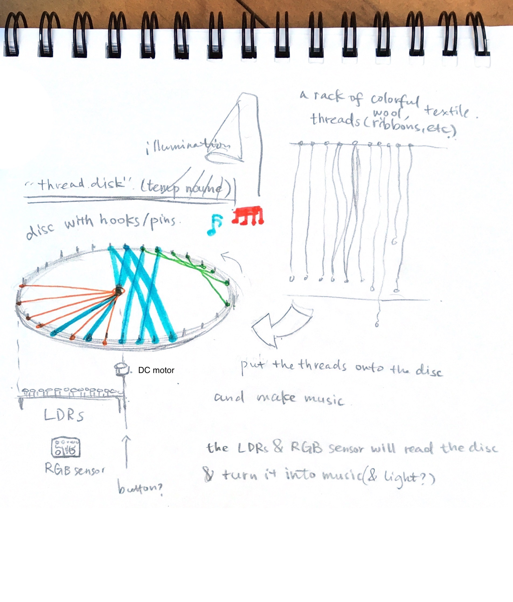
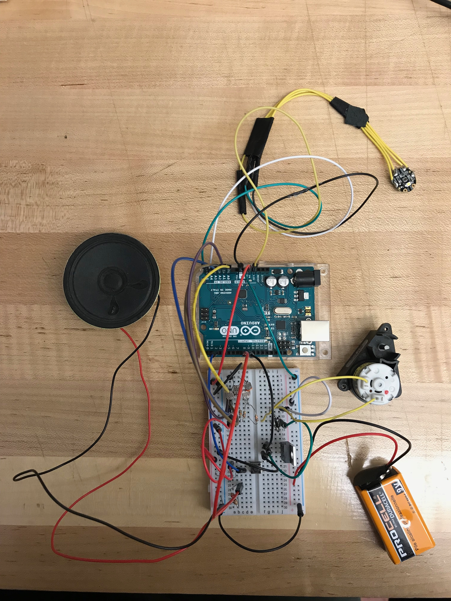
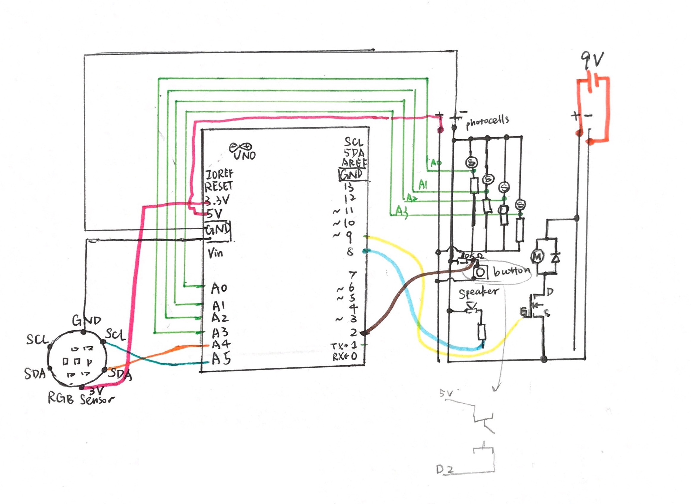
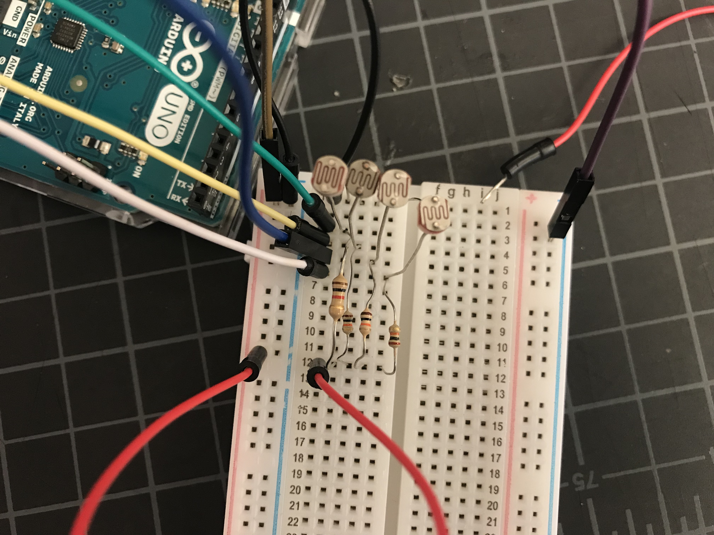
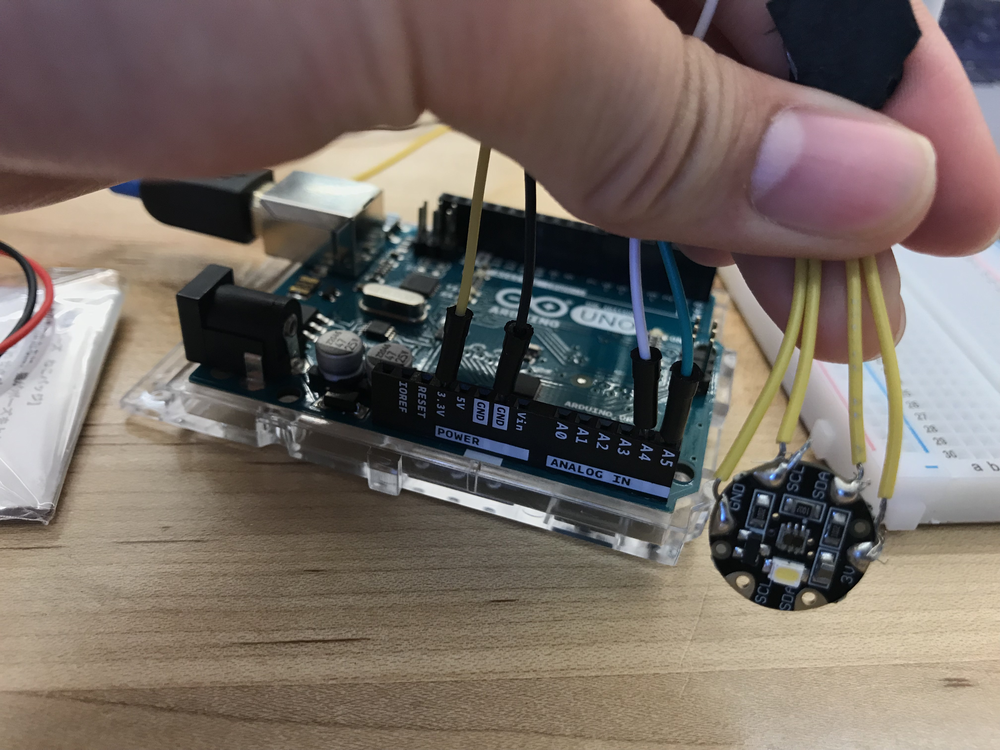
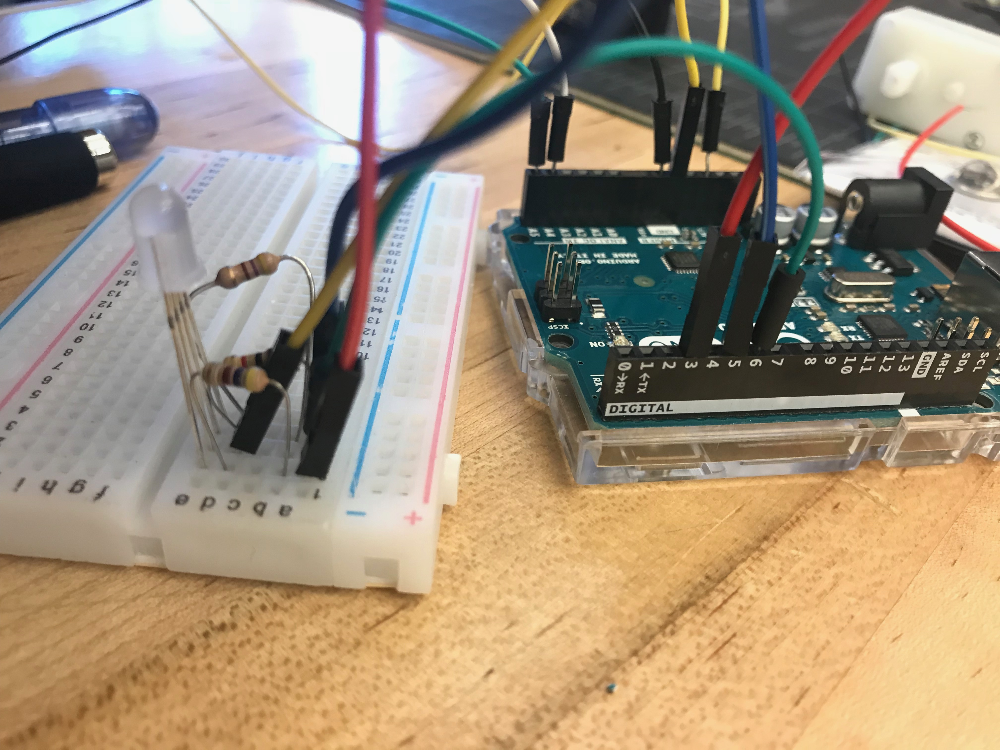
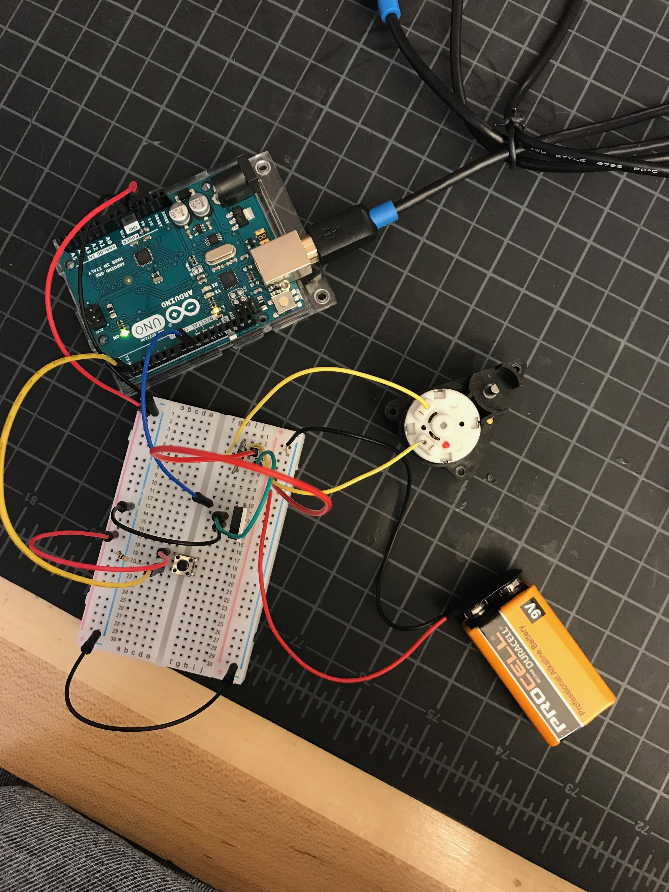

# Midterm Project Documentation

## ColorDisc

### Concept: A colorful disc woven by visitors.

Visitors may put any thread onto a transparent disc, which turns the colorful thread into music.
The disc will continuously rotate when the motor at its center is switched on. Beneath the disc, there is an array of LDRs and a RGB sensor. The sensors will read the brightness and color above it. Finally, the program will map the data to music, which will be shown with several speakers (or a computer, with processing.)

Sketch: 

Inspiration: [Dyskograf on Vimeo](https://vimeo.com/51700038)

[See original proposal](../README.md)

### Iteration 1

- I tested the photocells, the floral RGB sensor, the DC motor with a button, and the speaker.
- I put these components together with a breadboard.
- I roughly mapped the sensed data to simple tones.

### Components

#### Photocells
I used four photocells ([like this](https://www.sparkfun.com/products/9088)) to read the brightness distribution of a certain radius on the spinning disc.
For reference, I used the [tutorial](https://github.com/loopstick/ArduinoTutorial/blob/master/README.md#exercise-2) in the course repository and the [AnalogReadSerial](https://www.arduino.cc/en/Tutorial/AnalogReadSerial) example.
Here is the [code](code/LDR-AnalogReadSerial/LDR-AnalogReadSerial.ino) for reading a series of LDR data.

#### RGB Sensor
A [RGB sensor](https://learn.adafruit.com/adafruit-color-sensors) is used to read the color of the thread on the disc.

I borrowed the [Flora Sewable Version](https://www.adafruit.com/product/1356) from the Hybrid Lab for testing. And will use a regular [Breakout Board Version](https://www.adafruit.com/product/1334) for future iterations.
The driver and library is downloaded from [this link](https://github.com/adafruit/Adafruit_TCS34725).

[Notes]
> pins
> A4 (SDA), A5 (SCL)
>
> measurements
> Color Temperature - measured in Kelvin
> Lux - or Lumens per Square Meter
> R, G and B (filtered) values
> Clear (unfiltered) value

test codes
[to test a RGB LED](code/colorSensor-RGBtest/colorSensor-RGBtest.ino)
[to test a RGB sensor with the LED](code/colorSensor-LEDcolorview/colorSensor-LEDcolorview.ino)

#### DC Motor
I used [this tutorial](https://www.arduino.cc/en/Tutorial/TransistorMotorControl) to test this DC motor.
See [test code](code/motor/motor.ino).

#### Speaker
I referred to [this tutorial](https://www.arduino.cc/en/Tutorial/ToneKeyboard) to test the speaker.

### Initial Functionality:

- sense light and color
  - use an array of photocells to detect light
  - use a RGB sensor to detect color
- control a DC motor with a button
- map the data to simple tones

### Challenges

- Figuring out how to play music, which hardware/software to use, what sound to play, what code to write, how to fit it into the final exhibit;
- Drawing the schematic, designing the circuit, and soldering;
- Testing the physical parts and make it look good.

### Next Steps / Future Functionality:

- Make the Arduino [multi-task](https://www.arduino.cc/en/Tutorial/BlinkWithoutDelay) (without delay function);
- Figuring out what sound to play, and how to map sensor values to the music;
  - [Wave Shield](https://learn.adafruit.com/adafruit-wave-shield-audio-shield-for-arduino)
  - Or Processing, Max/msp
  - Or [Raspberry Pi](https://www.raspberrypi.org/)
- Design the circuit and soldering;
- Building the physical parts (the spinning disc, and the whole thing for display.)
